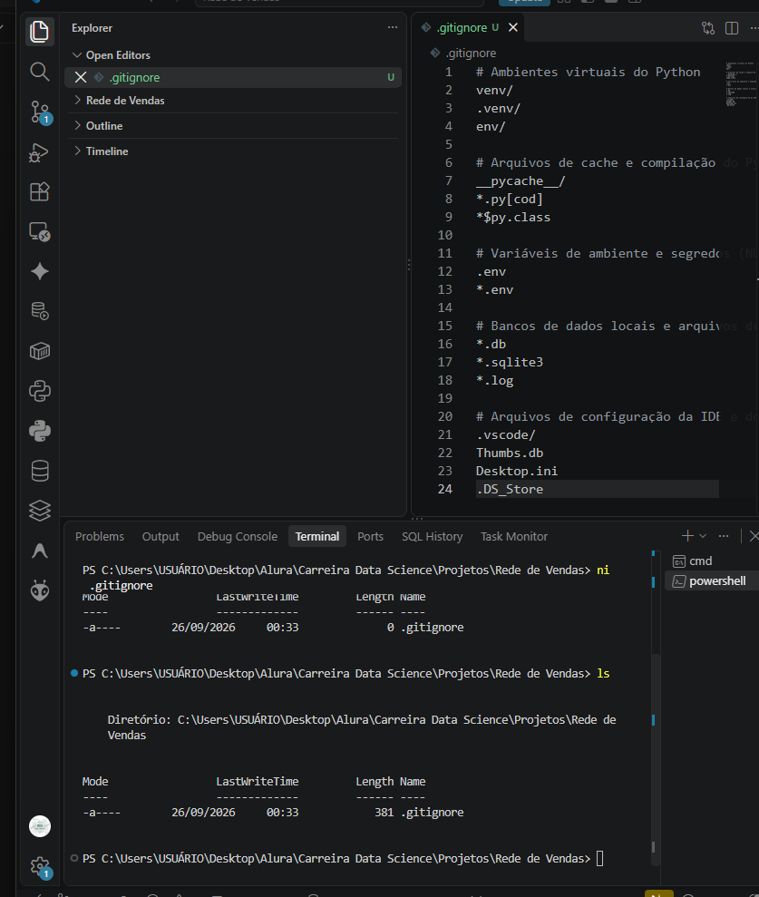
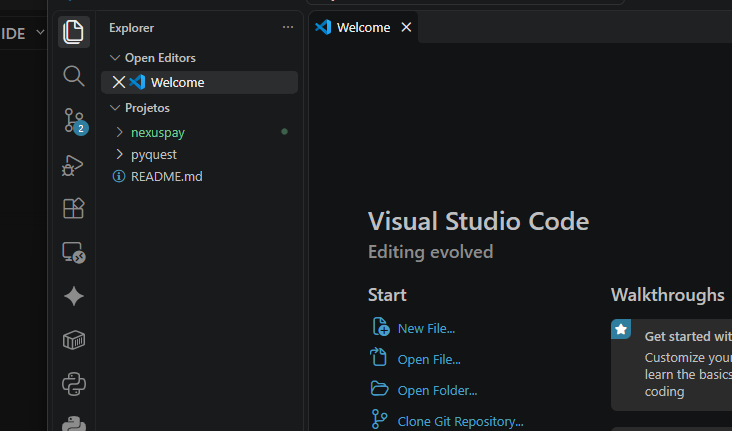
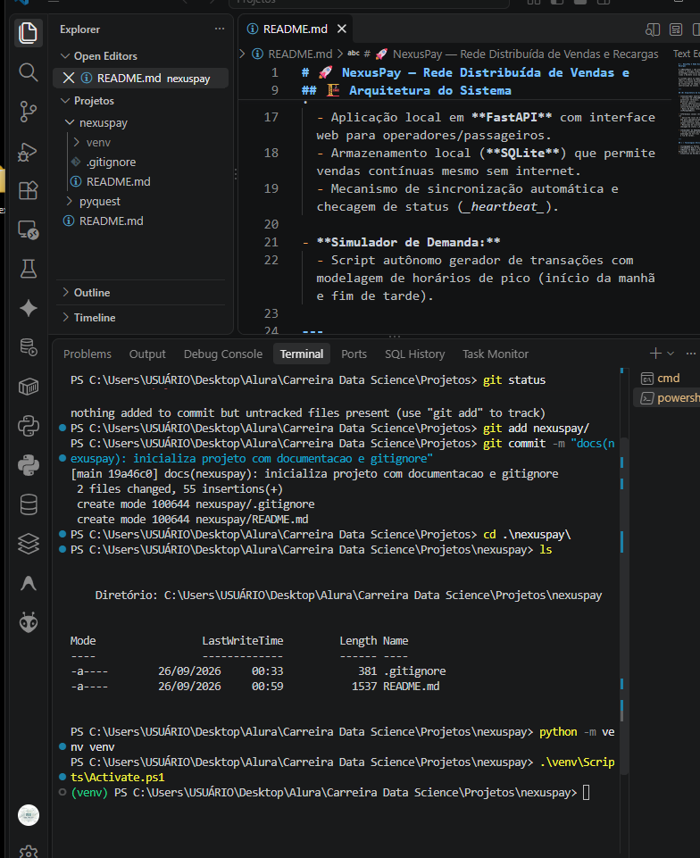
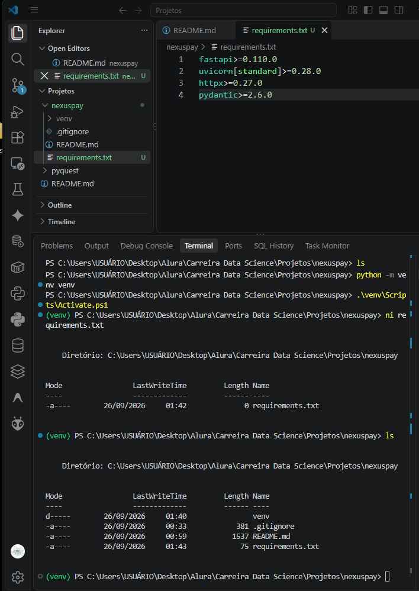
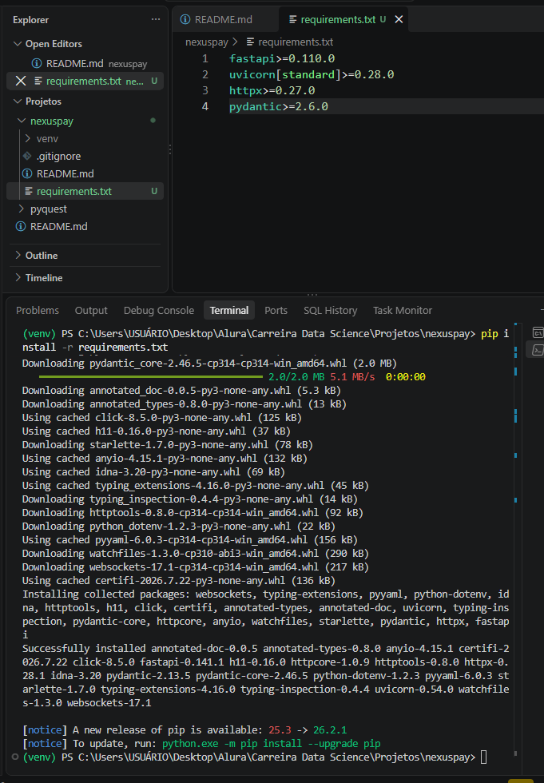
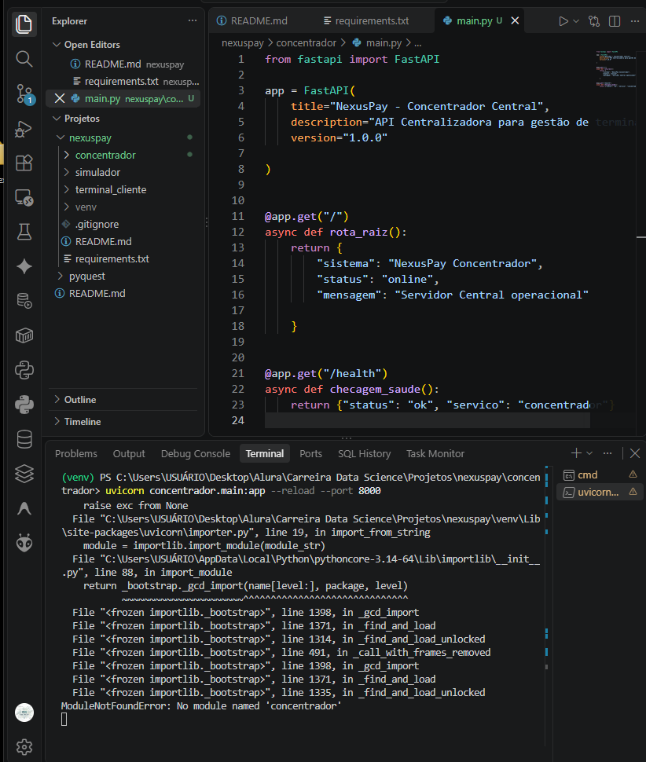
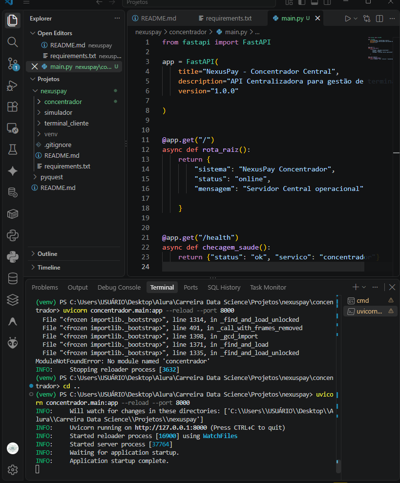
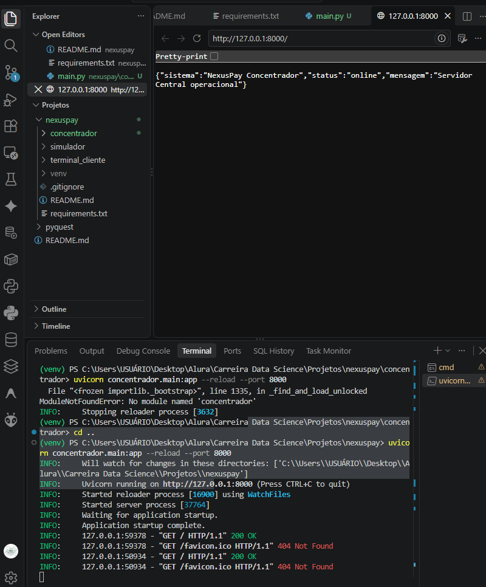

# 📘 NexusPay — Diário de Bordo & Documentação Técnica

## Etapa 1: Fundação, Arquitetura e Inicialização do Servidor Central

---

### 1. Visão Geral do Projeto

O **NexusPay** é uma plataforma distribuída de vendas e recargas inspirada no modelo de bilhetagem eletrônica de transporte público (como o sistema de recarga do Bilhete Único em São Paulo).

```text
                        ┌──────────────────────────────────────────┐
                        │       CONCENTRADOR CENTRAL (MATRIZ)      │
                        │  - FastAPI na porta 8000                 │
                        │  - Painel Admin & Kill Switch            │
                        │  - Banco Consolidado (PostgreSQL)        │
                        └─────────────────────┬────────────────────┘
                                              │ (HTTP / Webhooks)
                     ┌────────────────────────┴────────────────────────┐
                     ▼                                                 ▼
     ┌───────────────────────────────┐                 ┌───────────────────────────────┐
     │   TERMINAL CLIENTE 1 (LOCAL)  │                 │   TERMINAL CLIENTE 2 (LOCAL)  │
     │ - Ponto de Venda / Totem      │                 │ - Ponto de Venda / Totem      │
     │ - Banco Local Resiliente (DB) │                 │ - Banco Local Resiliente (DB) │
     └───────────────────────────────┘                 └───────────────────────────────┘
```

A premissa central é o aprendizado prático e profundo de **arquitetura de software**, **APIs assíncronas**, **sincronização de borda (edge/offline-first)** e **segurança**, com **custo zero** de infraestrutura.

---

### 2. Linha do Tempo e Desenvolvimento no VS Code

#### Passo 1: O "Escudo de Segurança" (`.gitignore`)

Iniciamos garantindo que nenhuma informação sigilosa (chaves de API, senhas, bancos de dados locais `.db`, arquivos de cache `__pycache__` ou ambientes virtuais `venv`) seja rastreada pelo projeto.



- **O que foi feito:** Criação do arquivo `.gitignore` com 24 linhas de regras de exclusão no VS Code.
- **Conceito:** Proteção ativa para manter o projeto limpo e prevenir vazamento de credenciais e caches compilados do Python.

---

#### Passo 2: Estrutura da Pasta no VS Code

A pasta do projeto foi padronizada com o nome minúsculo `nexuspay`, sem espaços ou caracteres especiais, garantindo organização limpa no explorador lateral.



- **Conceito:** Nomes limpos facilitam a navegação no terminal, compatibilidade entre sistemas operacionais (Windows/Linux) e importação de módulos.

---

#### Passo 3: Isolamento com Ambiente Virtual (`venv`)

Criamos um laboratório Python exclusivo para o `nexuspay` no terminal do VS Code para não misturar versões de bibliotecas globais da máquina.



- **Comandos executados:**
  ```powershell
  python -m venv venv
  .\venv\Scripts\Activate.ps1
  ```
- **Indicador visual:** O prefixo `(venv)` em verde no terminal confirma que o ambiente isolado está ativo.

---

#### Passo 4: Manifesto de Dependências (`requirements.txt`) e Instalação

Declaramos formalmente os pacotes necessários para o ecossistema assíncrono:



- `fastapi>=0.110.0` — Framework web assíncrono de alto desempenho.
- `uvicorn[standard]>=0.28.0` — Servidor ASGI para processamento de conexões de rede.
- `httpx>=0.27.0` — Cliente HTTP assíncrono para comunicação entre servidores.
- `pydantic>=2.6.0` — Validação estrita e modelagem de tipos de dados.

Instalamos todos os pacotes dentro do `venv` usando o gerenciador de pacotes:



```powershell
pip install -r requirements.txt
```

---

#### Passo 5: Criação dos Módulos e Código do Servidor Central

Criamos a estrutura modular com as três pastas do projeto:

```powershell
mkdir concentrador, terminal_cliente, simulador
```

Criamos o arquivo `concentrador/main.py` com o seguinte código:

```python
from fastapi import FastAPI

app = FastAPI(
    title="NexusPay — Concentrador Central",
    description="API Centralizadora para gestão de terminais e consolidação de vendas.",
    version="1.0.0"
)

@app.get("/")
async def rota_raiz():
    return {
        "sistema": "NexusPay Concentrador",
        "status": "online",
        "mensagem": "Servidor Central operacional"
    }

@app.get("/health")
async def checagem_saude():
    return {"status": "ok", "servico": "concentrador"}
```

- **Visão Macro do Código:** Este arquivo implementa a Matriz do sistema, expondo endpoints HTTP assíncronos capazes de receber requisições em formato JSON.

---

#### Passo 6: Debugging — O Aprendizado do _Working Directory_

Ao tentar iniciar o servidor de dentro da subpasta `concentrador`, o Python gerou um erro de módulo não encontrado:



- **Diagnóstico:** Como o terminal já estava em `...\nexuspay\concentrador`, a instrução `concentrador.main:app` tentava encontrar um caminho duplicado.
- **Solução:** Retornamos para a raiz do projeto com `cd ..` (`...\nexuspay`) para que os módulos sejam referenciados de maneira uniforme.

---

#### Passo 7: Servidor Central Operacional!

Executamos o servidor ASGI com recarregamento em tempo real:

```powershell
uvicorn concentrador.main:app --reload --port 8000
```



> **Resultado:** O Uvicorn inicializou o servidor com sucesso na porta 8000 (`http://127.0.0.1:8000`).

---

#### Passo 8: Verificação no Navegador e Requisições HTTP

Testamos a rota raiz pelo navegador em `http://127.0.0.1:8000/`:



- **Status 200 OK:** Confirma que a API processou e entregou o JSON com sucesso.
- **404 Not Found no favicon.ico:** Resposta normal da web, indicando que o navegador solicitou o ícone de aba que ainda não foi implementado.

---

### 3. Conceitos-Chave Fixados Nesta Sessão

1. **Ambiente Virtual (`venv`):** Isolamento estrito de dependências locais para evitar conflitos de versão entre projetos.
2. **ASGI vs WSGI:** O Uvicorn roda sobre ASGI (_Asynchronous Server Gateway Interface_), permitindo lidar com conexões assíncronas e concorrentes.
3. **Decoradores e Rotas (`@app.get`):** Padrão de projeto do FastAPI que vincula um método e URL a uma função assíncrona de negócio.
4. **Health Checks:** Padrão arquitetural indispensável para monitorar a saúde e disponibilidade contínua do servidor.
