# 📘 PyQuest: Guia Definitivo de Estudos & Diário de Bordo

Bem-vindo ao seu **Guia de Estudos Oficial do PyQuest**! 

Este documento foi estruturado especialmente para registrar cada etapa da construção do nosso jogo-curso de **Python e APIs**, documentando a teoria, os comandos práticos, os conceitos de arquitetura e os resultados visuais no terminal e no VS Code.

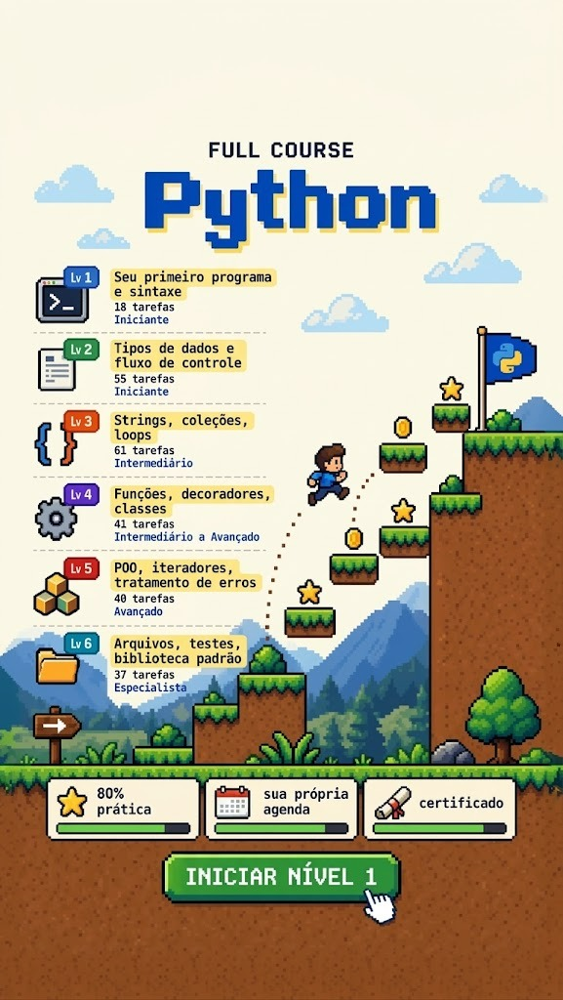

---

## 📌 Índice de Aprendizado
- [Etapa 1: O Primeiro Tijolo (Navegação & Pasta Raiz)](#-etapa-1-o-primeiro-tijolo-navegação--pasta-raiz)
- [Etapa 2: A Arquitetura em Três Pilares (`backend`, `frontend`, `curriculum`)](#-etapa-2-a-arquitetura-em-três-pilares)
- [Etapa 3: Subpastas do Frontend & O Superpoder de Voltar (`cd ..`)](#-etapa-3-subpastas-do-frontend--o-superpoder-de-voltar)
- [Etapa 4: A Lista de Ingredientes (`requirements.txt`) & O Gerenciador `pip`](#-etapa-4-a-lista-de-ingredientes-requirementstxt--o-gerenciador-pip)
- [Etapa 5: O Arquivo Mágico do Python — `__init__.py`](#-etapa-5-o-arquivo-mágico-do-python--__init__py)
- [Etapa 6: A Porta de Entrada da API — `main.py` & FastAPI](#-etapa-6-a-porta-de-entrada-da-api--mainpy--fastapi)
- [Etapa 7: A Trilha da Montanha — Rota `/api/levels` & O Poder do Debugging](#-etapa-7-a-trilha-da-montanha--rota-apilevels--o-poder-do-debugging)
- [Etapa 8: O Esqueleto Visual — `index.html` & O Dicionário de Tags](#-etapa-8-o-esqueleto-visual--indexhtml--o-dicionário-de-tags)
- [Etapa 9: A Moldura do Arcade — `retro_pixel.css` & Centralização Flexbox](#-etapa-9-a-moldura-do-arcade--retro_pixelcss--centralização-flexbox)
- [Etapa 10: O Topo de Status & O Logotipo 3D do Python](#-etapa-10-o-topo-de-status--o-logotipo-3d-do-python)
- [Etapa 11: A Base do Jogo — Grid de Rodapé & Botão 3D "START LEVEL 1"](#-etapa-11-a-base-do-jogo--grid-de-rodapé--botão-3d-start-level-1)

---

## 🧭 Etapa 1: O Primeiro Tijolo (Navegação & Pasta Raiz)

### 1. Conceito
Todo projeto de software precisa de um **Diretório Raiz** (Root Directory), ou seja, uma pasta dedicada onde todo o código do jogo fica isolado, sem misturar com outros scripts do computador.

No terminal, navegar pelas pastas funciona como um GPS:
- **`pwd`** (*Print Working Directory*): Responde a pergunta *"Onde eu estou agora?"*.
- **`cd`** (*Change Directory*): Comando para *"mudar de pasta"*.
- **`.` (ponto único)**: Significa *"aqui onde estou agora"* (caminho relativo).
- **`\` ou `/`**: O separador de pastas do sistema.

### 2. Comandos Utilizados
> ⚠️ **INSTRUÇÃO:** Execute os comandos abaixo no seu terminal (PowerShell ou Prompt de Comando):

```powershell
# Cria a pasta raiz do projeto
mkdir pyquest

# Entra dentro da pasta criada
cd .\pyquest\

# Lista o conteúdo para conferir se está vazia
ls
```

### 3. Resumo da Explicação
- O comando `cd .\pyquest\` usa um **caminho relativo**. Em vez de digitar todo o caminho longo (`C:\Users\USUÁRIO\...`), o `.` diz ao terminal: *"pegue a pasta pyquest que está aqui dentro deste local atual"*.
- O comando `ls` (*List*) não retornou nada porque a pasta foi recém-criada e está totalmente limpa e vazia.

### 4. Atividade Prática Realizada
Navegar até a pasta `projetos`, criar a pasta `pyquest` e conferir se ela estava limpa.

### 📸 Evidência do Resultado no Terminal:
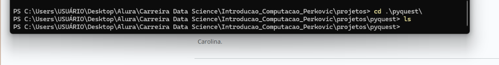

---

## 🏛️ Etapa 2: A Arquitetura em Três Pilares

### 1. Conceito
Na engenharia de software profissional, aplica-se o princípio de **Separação de Preocupações** (*Separation of Concerns*). Não misturamos lógica de servidor com telas ou regras pedagógicas:
1. **`backend`**: O cérebro do sistema (API, banco de dados, avaliador de código).
2. **`frontend`**: A casca visual (telas em HTML, estilos CSS de pixel art e scripts JS).
3. **`curriculum`**: O conteúdo didático (as fases da montanha, enunciados e testes).

### 2. Comandos Utilizados
> ⚠️ **INSTRUÇÃO:** Crie as três pastas principais dentro de `pyquest`:

```powershell
# Criação das pastas de arquitetura
mkdir backend
mkdir curriculum
mkdir frontend

# Listagem detalhada dos itens criados
ls
```

### 3. Resumo da Explicação (Decodificando a tela do PowerShell)
Ao rodar o `ls`, o PowerShell exibe colunas com metadados fundamentais:
- **`Mode` (`d-----`)**: A letra inicial **`d`** significa **Directory** (Diretório / Pasta). Se fosse um arquivo comum, começaria com **`a`** (*Archive*).
- **`LastWriteTime`**: Data e minuto exato da criação.
- **`Length`**: O tamanho em bytes (fica em branco para pastas porque elas contêm outros arquivos).
- **`Name`**: O nome da pasta.

### 4. Atividade Prática Realizada
Criação dos 3 diretórios mestres e conferência da coluna `Mode` com a letra `d`.

### 📸 Evidência do Resultado no Terminal:
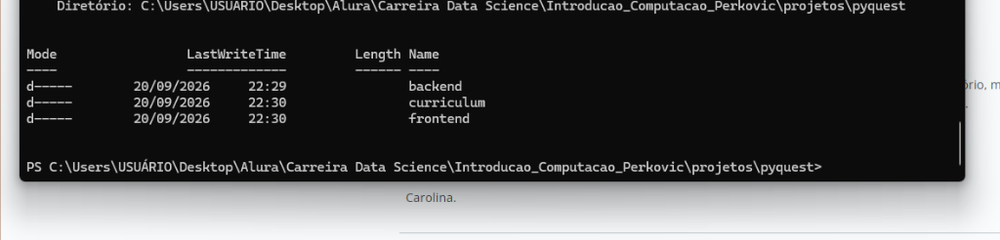

---

## 🌲 Etapa 3: Subpastas do Frontend & O Superpoder de Voltar

### 1. Conceito
O frontend web é dividido tradicionalmente entre **estilos visuais** (`css`) e **scripts dinâmicos** (`js`).
Para navegar entre pastas mães e pastas filhas:
- Entrar em uma pasta filha: `cd nome_da_pasta`
- Voltar para a pasta mãe (subir um nível): **`cd ..`** (dois pontos seguidos).

### 2. Comandos Utilizados
> ⚠️ **INSTRUÇÃO:** Entre no frontend, crie as subpastas e depois retorne à raiz:

```powershell
# 1. Entra na pasta visual
cd frontend

# 2. Cria as subpastas necessárias
mkdir css
mkdir js

# 3. Confere a criação
ls

# 4. Retorna para a pasta pyquest
cd ..
```

### 3. Resumo da Explicação
- Os dois pontos seguidos **`..`** são um padrão universal em sistemas operacionais que representam o "diretório pai".
- Isso evita ter que fechar o terminal ou digitar o caminho inteiro para voltar atrás.

### 4. Atividade Prática Realizada
Criação das pastas `css` e `js` dentro de `frontend` e retorno seguro à pasta raiz `pyquest`.

### 📸 Evidência do Resultado no Terminal:
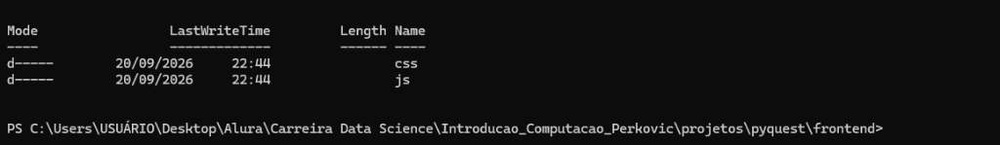

---

## 📦 Etapa 4: A Lista de Ingredientes (`requirements.txt`) & O Gerenciador `pip`

### 1. Conceito
Projetos modernos dependem de bibliotecas criadas pela comunidade. Em vez de instalar manualmente uma por uma, usamos o arquivo **`requirements.txt`**, que funciona como a "lista de compras" oficial do projeto.

- **`pip`** (*Pip Installs Packages*): O instalador oficial de pacotes do ecossistema Python.
- **`venv`** (*Virtual Environment*): Uma "bolha" isolada no computador que garante que as bibliotecas deste projeto não entrem em conflito com outros projetos.
- **`#` (Cerquilha/Hashtag)**: Indica uma linha de **comentário**. O computador ignora, servindo para seres humanos lerem.

### 2. Comandos e Código Utilizados
> ⚠️ **INSTRUÇÃO:** Crie o arquivo `requirements.txt` na raiz do projeto:

```powershell
# Criação do arquivo pelo terminal
ni requirements.txt
```

> 📝 **CÓDIGO:** Conteúdo a ser colado dentro do `requirements.txt`:

```text
# 1. Framework para criar a nossa API web em Python
fastapi

# 2. Servidor ultrarrápido que escuta a rede e entrega o jogo no navegador
uvicorn

# 3. Inspetor que valida se os dados enviados pelo jogador estão corretos
pydantic

# 4. Ferramenta para fazer requisições a outras APIs na internet
requests
```

> ⚠️ **INSTRUÇÃO:** Comando para o Python ler a lista e instalar tudo automaticamente:

```powershell
pip install -r requirements.txt
```

### 3. Resumo da Explicação
- Ao criar o arquivo com `ni requirements.txt`, o terminal exibiu `Mode: -a----` (a letra **`a`** confirma que é um arquivo!) e `Length: 0` (zero bytes por estar vazio).
- Após salvar o texto no VS Code, o `Length` aumentou para **316 bytes**.
- A flag **`-r`** avisa ao pip para ler (*read*) o arquivo de texto em vez de esperar nomes digitados no terminal.
- A mensagem `Requirement already satisfied` confirmou que todos os pacotes já estavam instalados e prontos no ambiente virtual (`venv`).

### 4. Atividade Prática Realizada
Criação do arquivo, edição no VS Code, conferência do tamanho em bytes e execução do comando `pip install -r requirements.txt`.

### 📸 Evidências dos Resultados:
**Arquivo criado com 0 bytes (`-a----`):**
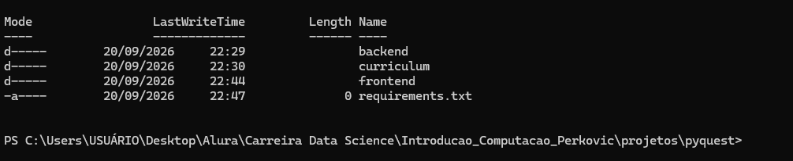

**Arquivo editado e salvo no VS Code:**
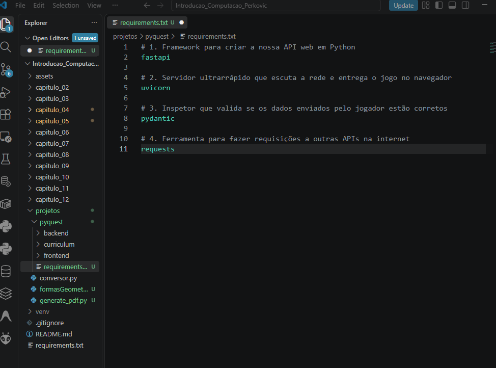

**Tamanho atualizado no PowerShell (316 bytes):**
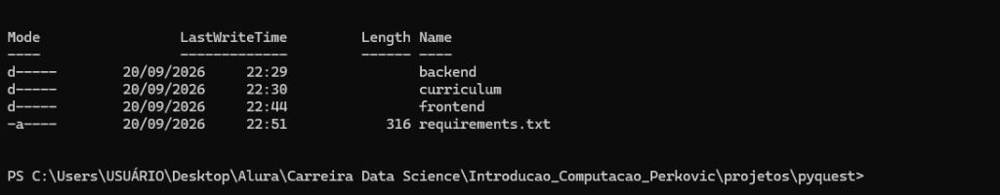

**Instalação confirmada pelo PIP:**
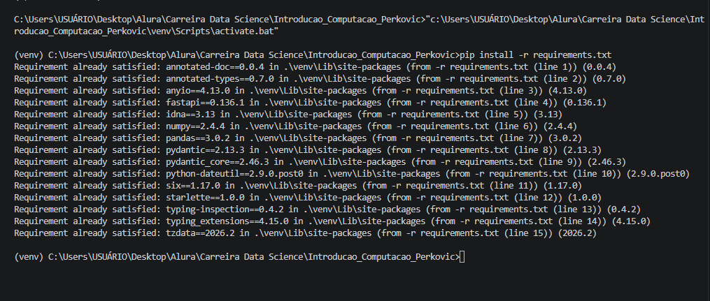

---

## 🐍 Etapa 5: O Arquivo Mágico do Python — `__init__.py`

### 1. Conceito
Como o Python diferencia uma pasta comum do Windows (com fotos ou documentos) de uma pasta de **código reutilizável**?
Através do arquivo **`__init__.py`**!

- **Por que `init`?** Vem de *Initialize* (Inicializar). É o código que roda quando a pasta é importada.
- **Por que dois tracinhos (`__`)?** Chamados de **Dunder** (*Double Underscore*). Servem para avisar ao Python que se trata de uma instrução mágica interna da linguagem, impedindo que desenvolvedores usem o nome sem querer.
- Se você criar com apenas 1 tracinho (`_init_.py`), o Python **não reconhece** o crachá de pacote!

### 2. Comandos Utilizados
> ⚠️ **INSTRUÇÃO:** Navegue até a pasta `backend` e crie o arquivo com a grafia exata:

```powershell
# Entra na pasta backend
cd backend

# Se tiver criado com nome errado, você pode renomear no terminal:
ren _init_.py __init__.py

# Ou criar diretamente com o nome certo:
ni __init__.py
```

### 3. Resumo da Explicação (Aprendizados Reais do Dia a Dia)
Nesta etapa ocorreram dois aprendizados práticos que todo programador passa:
1. **Pasta vs Arquivo**: Ao usar `mkdir _init_.py`, foi criada uma pasta (`d-----`). Usamos o comando `rmdir _init_.py` para remover a pasta e usamos `ni` para criar o arquivo (`-a----`).
2. **1 Traço vs 2 Traços**: Criamos com `_init_.py` e usamos o comando de terminal **`ren`** (*Rename*) para renomear direto no terminal para `__init__.py` sem precisar do mouse!

### 4. Atividade Prática Realizada
Correção da extensão, renomeação com `ren` e validação com `ls` mostrando `__init__.py` com `-a----`.

### 📸 Evidências da Evolução:
**Momento 1: Criado como pasta por engano (`d-----`):**
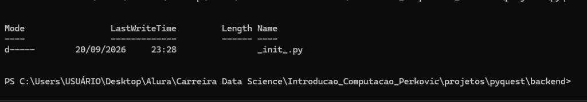

**Momento 2: Criado como arquivo, mas com 1 traço apenas:**
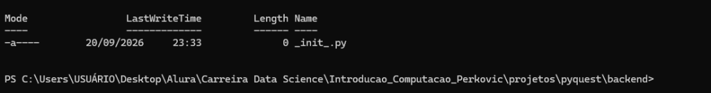

**Momento 3: Renomeado com sucesso para `__init__.py`:**
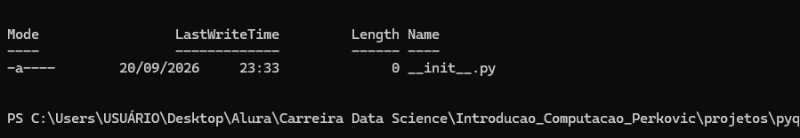

---

## 🚪 Etapa 6: A Porta de Entrada da API — `main.py` & FastAPI

### 1. Conceito
- **API (Application Programming Interface)**: É o garçom do sistema! O cliente (navegador/jogo) pede uma informação, a API busca no backend e entrega a resposta pronta em formato **JSON**.
- **`main.py`**: A convenção mundial para o arquivo principal de inicialização de um servidor.
- **Decorator (`@app.get`)**: Uma etiqueta com superpoderes no Python. O `@` liga uma URL da internet a uma função Python específica.
- **JSON**: O formato universal de texto leve usado por todas as linguagens da web.

### 2. Comandos e Código da API
> ⚠️ **INSTRUÇÃO:** Crie o arquivo `main.py` dentro da pasta `backend`:

```powershell
# Criação do arquivo principal
ni main.py
```

> 📝 **CÓDIGO:** Escreva o código do seu primeiro servidor no `backend/main.py`:

```python
# 1. IMPORTAÇÃO: Trazemos a classe FastAPI da biblioteca instalada
from fastapi import FastAPI

# 2. INSTANCIAÇÃO: Damos vida ao aplicativo web
app = FastAPI(title="PyQuest API")

# 3. ROTA (ENDPOINT): Criamos a rota HTTP GET '/api/status'
@app.get("/api/status")
def checar_status():
    # 4. RESPOSTA: Retornamos um dicionário que o FastAPI converte em JSON
    return {
        "status": "online",
        "jogo": "PyQuest",
        "fase_atual": 1,
        "mensagem": "Servidor do PyQuest operando com sucesso!"
    }
```

### 3. Resumo da Explicação
- `from fastapi import FastAPI`: Importa a fábrica de APIs.
- `app = FastAPI(...)`: Cria o servidor.
- `@app.get("/api/status")`: Escuta requisições do tipo leitura (GET).
- `return { ... }`: Devolve os dados empacotados em JSON para qualquer cliente.

### 4. Atividade Prática Realizada
Criação dos arquivos `__init__.py` e `main.py`, estruturação da primeira rota de API `/api/status` e organização das abas no VS Code.

### 📸 Evidências da Etapa 6:
**Código escrito e organizado no VS Code:**
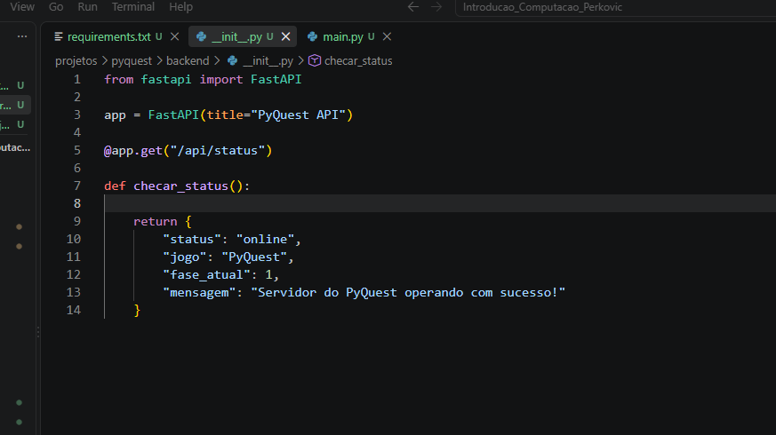

**Arquivos salvos com sucesso no disco (main.py: 291 bytes, __init__.py: 21 bytes):**
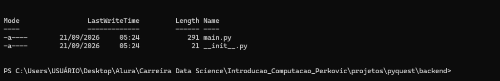

**O Clássico Erro do Windows (`uvicorn não é reconhecido`):**
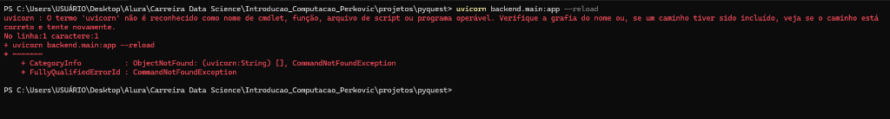

#### 💡 O Segredo do `python -m`:
Quando o Windows diz que `uvicorn` não é reconhecido, significa que a pasta de atalhos (`Scripts`) não está cadastrada nas variáveis de ambiente do sistema operacional (PATH).
A solução universal dos desenvolvedores Python é usar o comando:
```powershell
python -m uvicorn backend.main:app --reload
```
A flag **`-m`** significa **Module** (Módulo). Em vez de pedir para o Windows encontrar o programa, você pede diretamente para o **Python**: *"Python, execute o módulo uvicorn que está instalado na sua biblioteca!"*.

**Servidor Uvicorn rodando com sucesso no terminal:**
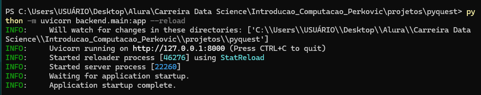

**Navegador consumindo a API e exibindo JSON (/api/status):**
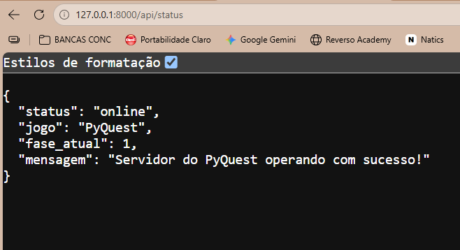

**Documentação interativa Swagger UI testando a rota com 200 OK (/docs):**
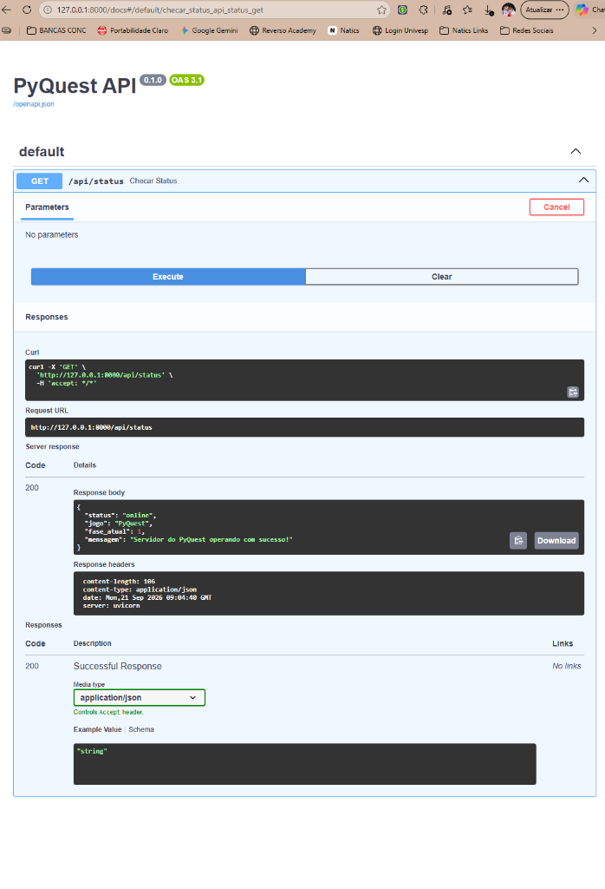

---

## 🏔️ Etapa 7: A Trilha da Montanha — Rota `/api/levels` & O Poder do Debugging

### 1. Conceito
Nesta etapa, adicionamos ao servidor a inteligência sobre as fases da montanha do curso de Python:
- **Lista de Dicionários no Python (`[ { ... }, { ... } ]`)**: Uma lista ordenada onde cada item é um dicionário contendo informações da fase (`id`, `badge`, `titulo`, `tarefas`, `dificuldade`, `desbloqueado`).
- **Array de Objetos JSON**: Como a web enxerga e consome essa lista do Python.
- **O Papel do Decorator (`@`)**: O `@` é obrigatório para avisar ao FastAPI que a função abaixo dele é uma rota da web. Sem ele, a função vira apenas uma função Python comum e a API não a enxerga!
- **Códigos de Status HTTP**:
  - **`200 OK`**: A rota foi encontrada e a resposta foi entregue com sucesso.
  - **`404 Not Found`**: O endereço solicitado na URL não existe ou não foi registrado no servidor.

### 2. Código Adicionado no `backend/main.py`
> 📝 **CÓDIGO:** Nova rota adicionada ao servidor:

```python
# 5. ROTA DAS FASES: Devolve a lista de níveis da montanha do curso
@app.get("/api/levels")
def listar_niveis():
    return [
        {
            "id": 1,
            "badge": "Lv 1",
            "titulo": "Your first program and syntax",
            "tarefas": 18,
            "dificuldade": "Beginner",
            "desbloqueado": True
        },
        {
            "id": 2,
            "badge": "Lv 2",
            "titulo": "Data types and control flow",
            "tarefas": 55,
            "dificuldade": "Beginner",
            "desbloqueado": False
        },
        {
            "id": 3,
            "badge": "Lv 3",
            "titulo": "Strings, collections, loops",
            "tarefas": 61,
            "dificuldade": "Intermediate",
            "desbloqueado": False
        }
    ]
```

### 3. Resumo da Explicação & O Aprendizado de Debugging
Durante a implementação desta rota, aconteceu um momento pedagógico brilhante:
1. Ao acessar `/api/levels`, o terminal registrou **`404 Not Found`** em vermelho.
2. O próprio aluno inspecionou o código e identificou a causa raiz com olhar clínico: *"esqueci o @ antes do app.get no código"*.
3. Sem o `@`, o FastAPI não sabia que a função `listar_niveis()` era um endpoint web!
4. Ao adicionar o `@`, o Uvicorn detectou a alteração sozinho via **`StatReload`** e a rota `/api/levels` nasceu imediatamente no Swagger UI!

### 4. Atividade Prática Realizada
Criação da rota dos níveis, diagnóstico e correção do erro 404, e validação no Swagger UI.

### 📸 Evidências da Etapa 7:
**StatReload detectando o arquivo salvo e recarregando o servidor:**
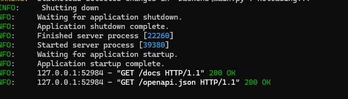

**O Erro 404 no terminal antes de colocar o `@`:**
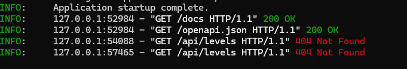

**A Nova Rota `/api/levels` Aparecendo com Sucesso no Swagger UI:**
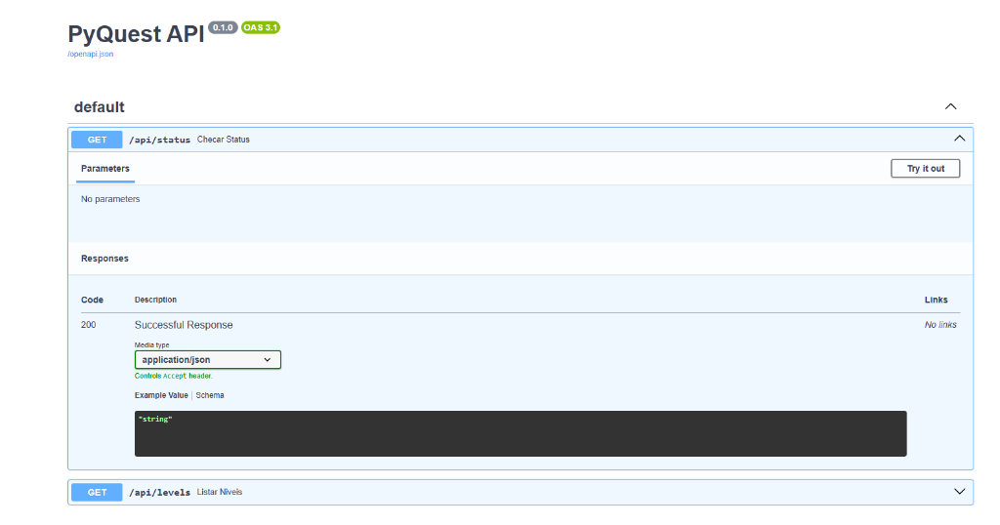

**A Rota `/api/levels` Executada com Sucesso (Code 200) e Entregando os Níveis em JSON:**
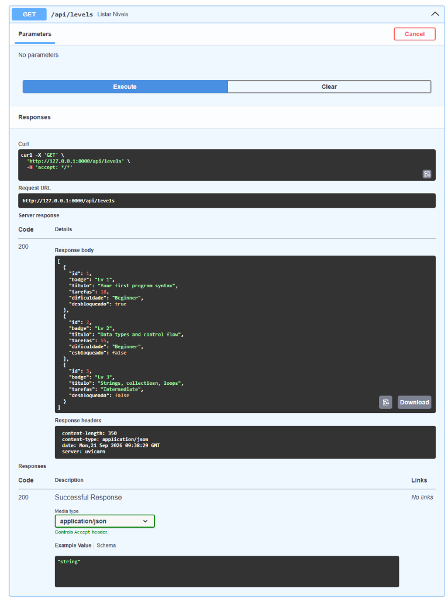

---

## 🦴 Etapa 8: O Esqueleto Visual — `index.html` & O Dicionário de Tags

### 1. Conceito
O HTML (**H**yper**T**ext **M**arkup **L**anguage) é a linguagem de marcação que define a **estrutura e o conteúdo** da página (o esqueleto). Sem CSS, ele é cru e monocromático, mas define com precisão onde cada componente existe.

#### 📖 O Dicionário Definitivo das Tags HTML Utilizadas:
- **`<div>` (Division / Divisória)**: A caixa de papelão genérica. É um elemento de **bloco** (*block*), ocupando 100% da largura e empurrando o próximo elemento para a linha de baixo. Usada puramente para agrupar e organizar layout.
- **`<span>` (Trecho / Extensão)**: O saquinho plástico transparente. É um elemento de **linha** (*inline*), **não pula de linha** e fica coladinho ao texto vizinho (ex: ⭐ e o número de estrelas lado a lado).
- **`<header>` (Cabeçalho)**: Tag semântica que avisa ao navegador e buscadores: *"Aqui é a barra de topo/status do jogo!"*.
- **`<main>` (Conteúdo Principal)**: Tag semântica que guarda o coração da tela (o mapa da montanha e as fases).
- **`<section>` (Seção / Capítulo)**: Usada para agrupar um assunto com tema próprio e título (ex: a área do título do curso).
- **`<footer>` (Rodapé)**: Tag semântica que define a base ou chão da tela (guarda os 3 cards).
- **`<h1>` (Heading 1)**: O título de nível 1, mais importante da página. O navegador deixa grande e em negrito por padrão. Só deve existir um único `<h1>` por página.
- **`<button>` (Botão Nativo)**: Elemento interativo que já vem com foco, acessibilidade e clique de mouse embutidos.
- **`<strong>` (Importância Forte)**: Deixa o texto em negrito semântico (usado nos números de moedas).

#### 🏷️ A Diferença Crucial entre `class` e `id`:
- **`class="..."` (A etiqueta de roupa para o CSS)**: Uma classe serve para aplicar o mesmo estilo visual a vários elementos (ex: `.feature-card`). No CSS, é selecionada com um **ponto** (`.`).
- **`id="..."` (O CPF / RG exclusivo para o JavaScript e Python)**: Um ID é um identificador **único no mundo** naquela página (ex: `#starsCount`, `#startLevelBtn`). Não pode se repetir. No CSS/JS, é selecionado com a **cerquilha** (`#`).

### 2. Código HTML Estrutural (`frontend/index.html`)
> 📝 **CÓDIGO:** Estrutura base da tela:

```html
<!DOCTYPE html>
<html lang="pt-BR">
<head>
    <meta charset="UTF-8">
    <meta name="viewport" content="width=device-width, initial-scale=1.0">
    <title>PyQuest: Full Course Python & APIs</title>
    <link rel="stylesheet" href="css/retro_pixel.css">
</head>
<body>
    <div class="game-device">
        <header class="device-header">
            <div class="header-title">🐍 PYQUEST</div>
            <div class="stats-badges">
                <span>⭐ <strong id="starsCount">0</strong></span>
                <span>🪙 <strong id="coinsCount">0</strong></span>
            </div>
        </header>
        <main class="game-viewport">
            <section class="course-title-section">
                <div class="sub-header-tag">FULL COURSE</div>
                <h1 class="main-python-logo">Python</h1>
            </section>
            <div class="mountain-scene-container">
                <div class="levels-track" id="levelsTrack"></div>
                <div class="mountain-backdrop" id="mountainScene"></div>
            </div>
        </main>
        <footer class="features-footer-grid">
            <div class="feature-card"><span>⭐ 80% practice</span></div>
            <div class="feature-card"><span>💼 your own schedule</span></div>
            <div class="feature-card"><span>📜 certificate</span></div>
        </footer>
        <div class="action-banner-area">
            <button id="startLevelBtn" class="start-btn-pixel">START LEVEL 1 👆</button>
        </div>
    </div>
</body>
</html>
```

### 3. Resumo da Explicação
- Criamos o esqueleto com tags semânticas e identificadores (`class` e `id`).
- Na primeira visualização no navegador, tudo apareceu empilhado em preto e branco com fonte serifada padrão (Times New Roman), comprovando que o HTML sozinho é a estrutura nua sem estilo.

### 📸 Evidências da Etapa 8:
**Estrutura digitada no VS Code:**
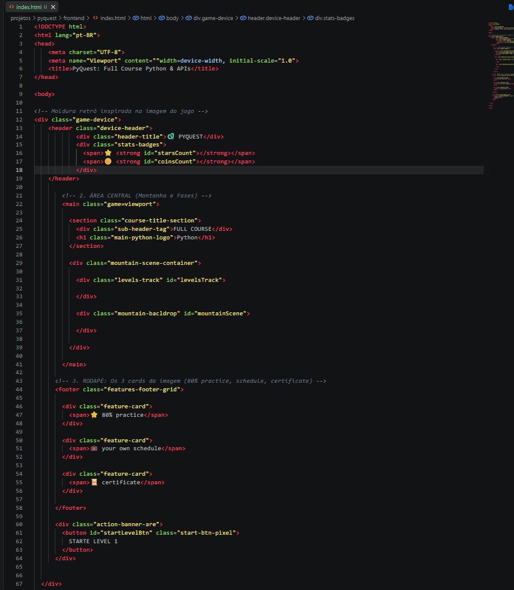

**O HTML puro no navegador (sem CSS):**
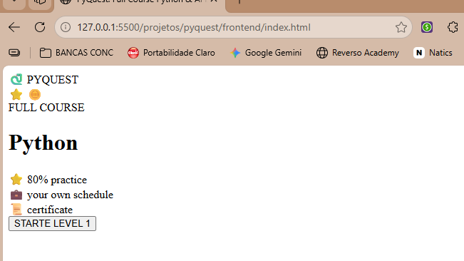

---

## 🎨 Etapa 9: A Moldura do Arcade — `retro_pixel.css` & Centralização Flexbox

### 1. Conceito
O CSS (**C**ascading **S**tyle **S**heets) é a camada de design. Ele busca as tags, classes e IDs do HTML e aplica regras visuais.
- **A Tag `<link rel="stylesheet" href="css/retro_pixel.css">`**: O "cabo de energia" que faz o HTML carregar a folha de estilos.
- **`@import url(...)`**: Baixa a fonte retrô oficial dos videogames dos anos 80/90 (`Press Start 2P`) direto do Google Fonts.
- **`body` e Centralização Absoluta com Flexbox**:
  - `min-height: 100vh`: Faz a tela ocupar 100% da altura da janela visível (*viewport height*).
  - `display: flex; justify-content: center; align-items: center;`: A trinca mágica do CSS moderno que coloca o console de videogame no centro exato do monitor, não importa a resolução!
- **`.game-device` (O Console Portátil)**:
  - `max-width: 450px`: Limita a largura para simular um celular ou tela arcade vertical.
  - `background: #f7f3e9`: A cor pergaminho/creme autêntica da imagem de referência.
  - `border: 5px solid #1E293B`: A borda chanfrada escura de pixel art.
  - `box-shadow: 0 15px rgba(0,0,0,0.6)`: Sombra projetada que dá sensação de profundidade sobre a mesa.

### 2. Código CSS Inicial
```css
@import url('https://fonts.googleapis.com/css2?family=Press+Start+2P&display=swap');

body {
    background-color: #111827;
    font-family: 'Press Start 2P', monospace;
    min-height: 100vh;
    display: flex;
    justify-content: center;
    align-items: center;
    margin: 0;
}

.game-device {
    width: 100%;
    max-width: 450px;
    min-height: 750px;
    background: #f7f3e9;
    border: 5px solid #1E293B;
    border-radius: 18px;
    box-shadow: 0 15px rgba(0, 0, 0, 0.6);
    display: flex;
    flex-direction: column;
    overflow: hidden;
}
```

### 📸 Evidências da Etapa 9:
**Regras de centralização e moldura no VS Code:**
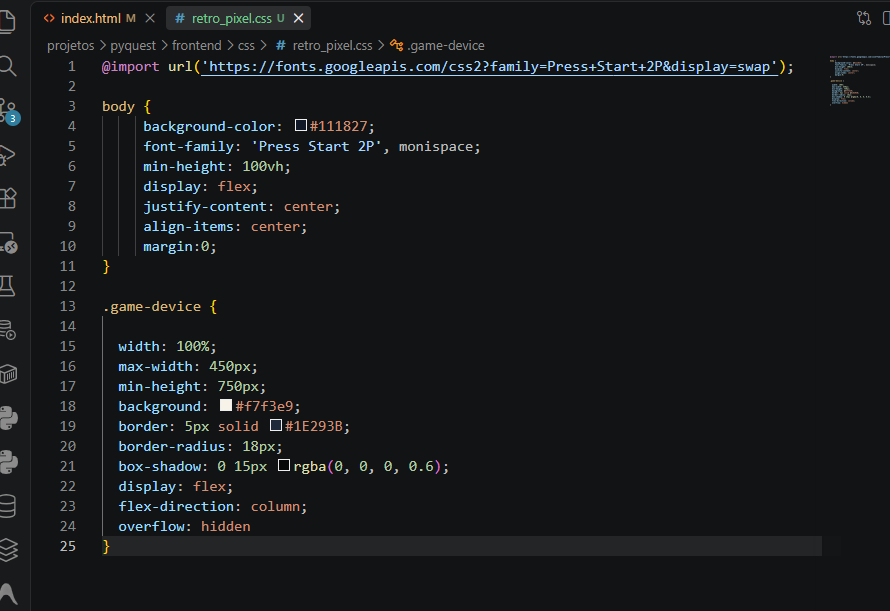

**A tela se transformando em um console retrô centralizado:**
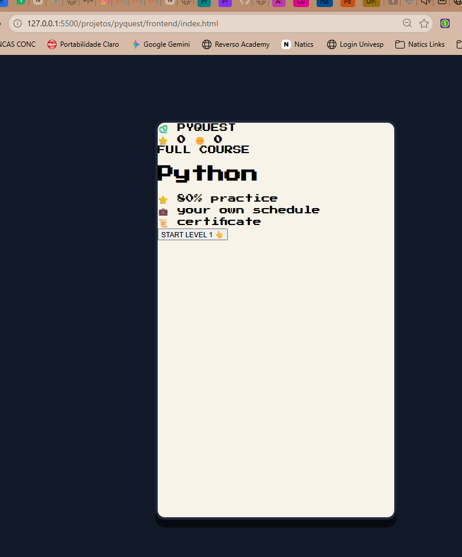

---

## 🐍 Etapa 10: O Topo de Status & O Logotipo 3D do Python

### 1. Conceito
Nesta etapa, resolvemos o problema dos textos espremidos no topo da moldura:
- **`justify-content: space-between`**: Funciona como dois ímãs de mesmo polo. Empurra o título `🐍 PYQUEST` para a extremidade esquerda e as moedas/estrelas para a extremidade direita da barra!
- **`padding: 10px 16px`**: Dá o respiro interno para o texto não ficar colado nas bordas da caixa.
- **`letter-spacing: 2px`**: Afasta as letras de "FULL COURSE" para dar ar elegante de capa de videogame.
- **`color: #2B5D8C`**: O azul royal autêntico da identidade visual do Python.
- **`text-shadow: 3px 3px 0 #1E3A5A`**: Cria o relevo 3D de pixel art sólido, sem esfumaçamento moderno, dando volume de bloco à palavra "Python".

### 2. Código CSS do Cabeçalho e Título
```css
.device-header {
    background-color: #1E293B;
    color: #E2E8F0;
    padding: 10px 16px;
    display: flex;
    justify-content: space-between;
    align-items: center;
    font-size: 8px;
    border-bottom: 3px solid #0F172A;
}

.stats-badges {
    display: flex;
    gap: 12px;
}

.course-title-section {
    text-align: center;
    padding: 24px 10px 10px 10px;
}

.sub-header-tag {
    font-size: 10px;
    letter-spacing: 2px;
    color: #64748B;
    margin-bottom: 8px;
    font-weight: bold;
}

.main-python-logo {
    font-size: 32px;
    color: #2B5D8C;
    letter-spacing: 1px;
    margin: 0;
    text-shadow: 3px 3px 0 #1E3A5A;
}
```

### 📸 Evidências da Etapa 10:
**Topo e Logotipo 3D renderizados com fidelidade no navegador:**
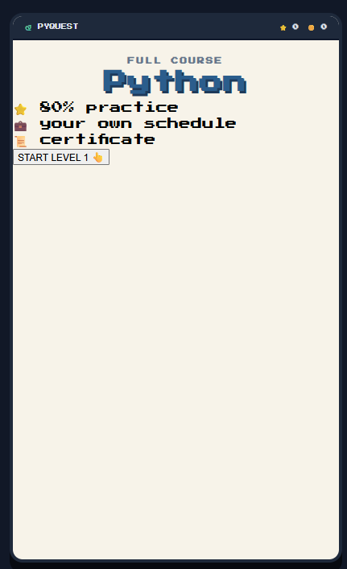

**Regras do topo escritas no VS Code:**
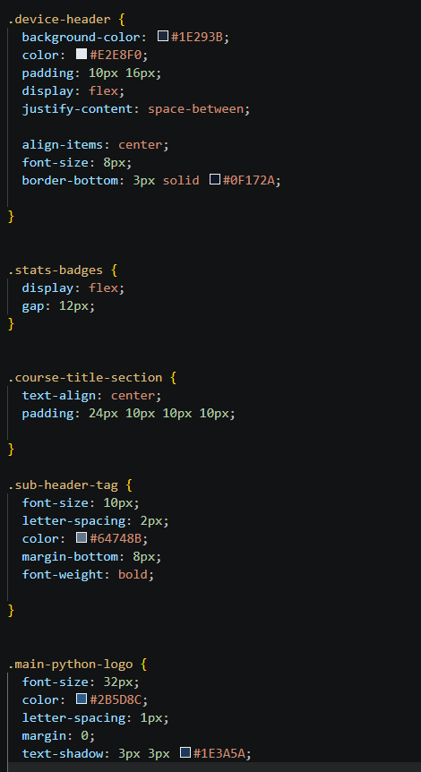

---

## 🎮 Etapa 11: A Base do Jogo — Grid de Rodapé & Botão 3D "START LEVEL 1"

### 1. Conceito
Travar a base do console com o chão de terra da montanha, os cards informativos e o botão clicável tátil:
- **`margin-top: auto`**: Como a moldura usa `display: flex; flex-direction: column`, a margem superior automática funciona como uma mola hidráulica: empurra o rodapé até encostar no chão absoluto do videogame!
- **`display: grid` com `grid-template-columns: repeat(3, 1fr)`**: Divide o rodapé em 3 fatias perfeitamente iguais (`1fr` = 1 fração), posicionando os 3 cards lado a lado automaticamente.
- **`background: linear-gradient(180deg, #48BB78 0%, #2F855A 100%)`**: Degradê vertical que vai do verde vivo ao verde escuro, dando volume tátil ao botão.
- **`box-shadow: 0 6px 0 #1A4731`**: Sombra sólida verde-escura de 6px que faz o botão parecer um tijolo alto.
- **A Pseudo-classe `:active`**: Acionada apenas enquanto o mouse estiver pressionando o botão.
  - `transform: translateY(4px)`: Faz o botão descer 4 pixels fisicamente na tela.
  - `box-shadow: 0 2px 0 #1A4731`: Reduz a sombra para 2px, gerando o feedback realista de botão afundando!

### 2. Código CSS da Base e Botão
```css
.features-footer-grid {
    background-color: #58371B;
    border-top: 5px solid #599C2A;
    padding: 10px 12px;
    display: grid;
    grid-template-columns: repeat(3, 1fr);
    gap: 6px;
    margin-top: auto;
}

.feature-card {
    background: #FAF7F0;
    border: 2px solid #1E293B;
    border-radius: 6px;
    padding: 8px 4px;
    text-align: center;
    font-size: 6px;
    line-height: 1.3;
    color: #1E293B;
    display: flex;
    align-items: center;
    justify-content: center;
}

.action-banner-area {
    background-color: #754C29;
    padding: 12px 16px 18px 16px;
    text-align: center;
}

.start-btn-pixel {
    width: 100%;
    padding: 14px 10px;
    background: linear-gradient(180deg, #48BB78 0%, #2F855A 100%);
    color: #FFFFFF;
    font-family: 'Press Start 2P', monospace;
    font-size: 13px;
    border: 3px solid #1E293B;
    border-radius: 8px;
    box-shadow: 0 6px 0 #1A4731, 0 8px 12px rgba(0, 0, 0, 0.3);
    cursor: pointer;
    text-shadow: 1px 1px 0 #143A26;
    transition: all 0.1s ease;
}

.start-btn-pixel:active {
    transform: translateY(4px);
    box-shadow: 0 2px 0 #1A4731;
}
```

### 📸 Evidências da Etapa 11:
**A moldura completa travada no topo e na base com o botão 3D:**
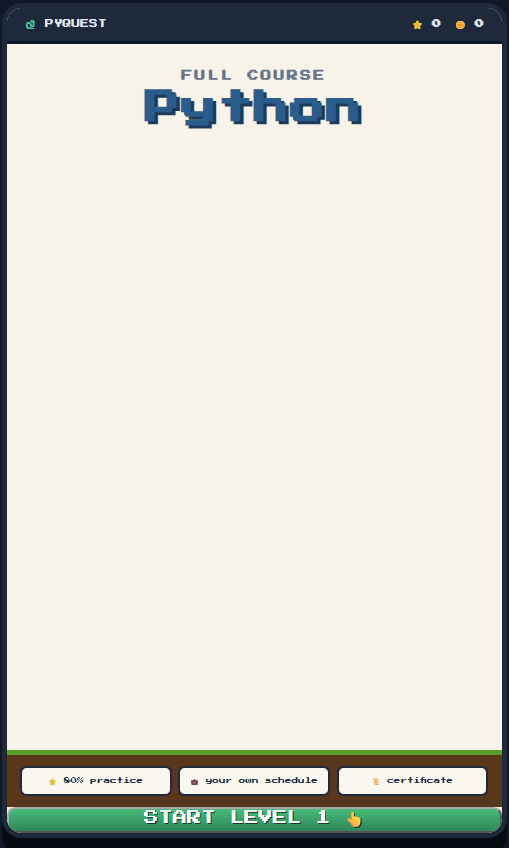

**Comentários didáticos detalhados no VS Code:**
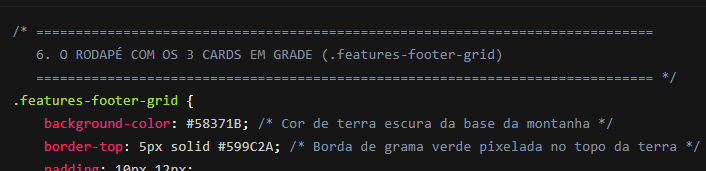

**Resultado Final Polido e Clean:**
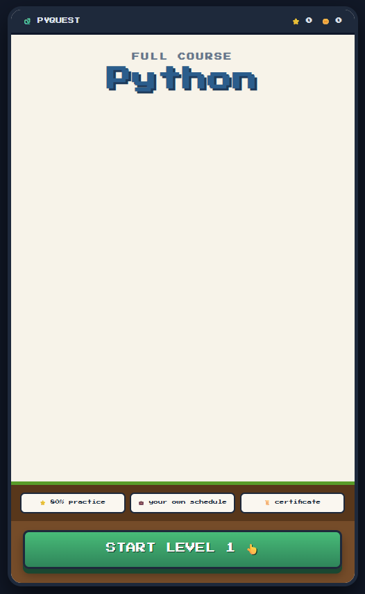

---

> 💡 **Dica de Estudo:** Você pode consultar este arquivo a qualquer momento no seu VS Code abrindo `GUIA_DE_ESTUDOS.md`. Para visualizar formatado com as imagens no VS Code, aperte `Ctrl + Shift + V`!


