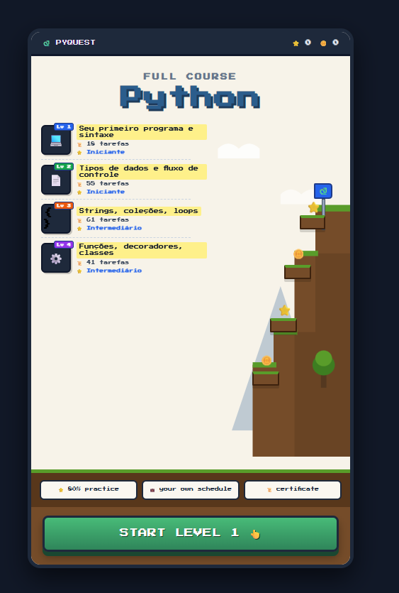

# 🎮 PyQuest — O Jogo-Curso de Python & APIs REST

O **PyQuest** é um jogo educativo gamificado com estética retrô 16-bit, onde o jogador escala uma montanha de desafios práticos para aprender programação do zero até a construção e consumo de APIs REST reais em Python.

A aplicação opera em uma arquitetura Full-Stack desacoplada, combinando um backend ágil em **FastAPI** com um frontend retrô construído em **HTML5**, **CSS Pixel Art** e **JavaScript Assíncrono**.

---

## 📸 Demonstração do Jogo

<div align="center">
  
  <p><em>Interface do console retrô com montanha animada e trilha de fases consumida via API</em></p>
</div>

---

## ✨ Principais Funcionalidades

- **Trilha de Fases Dinâmica**: O currículo de aprendizado é servido pelo backend via API JSON e renderizado em tempo real pelo JavaScript.
- **Cenário Retrô em Pixel Art**: Montanha construída em SVG com plataformas suspensas, moedas de ouro e estrelas com animações de levitação (`@keyframes`).
- **Console Portátil Interativo**: Moldura inspirada em videogames clássicos, com botão 3D de clique tátil e seleção de fases interativa.
- **Arquitetura Full-Stack Real**: Comunicação assíncrona (`fetch`) entre o navegador e o servidor Python com controle de CORS.

---

## 🏗️ Arquitetura do Projeto

- **`backend/` (Servidor & API)**:
  - Desenvolvido em **Python 3.10+** com **FastAPI**.
  - Rotas RESTful (`/api/status` e `/api/levels`).
  - Servido com alto desempenho pelo **Uvicorn** com recarregamento em tempo real.
  - Middleware de segurança **CORS** para liberação de requisições web.

- **`frontend/` (Interface & Experiência do Jogador)**:
  - **HTML5 Semântico**: Estrutura modular dividida entre console, cabeçalho de status, viewport do jogo e rodapé de ações.
  - **CSS3 Pixel Art**: Tipografia retrô (_Press Start 2P_), layout em CSS Grid & Flexbox, e efeitos táteis no botão principal.
  - **JavaScript Vanilla (ES6+)**: Consumo da API REST via `fetch`, manipulação dinâmica do DOM e escuta de eventos de clique.

---

## 🛠️ Tecnologias Utilizadas

- **Linguagem Backend**: Python 3.10+
- **Framework Web**: FastAPI & Uvicorn
- **Frontend**: HTML5, CSS3 Moderno, JavaScript Vanilla (ES6+)
- **Design & Gráficos**: SVG Vetorial e Pixel Art
- **Controle de Versão**: Git & GitHub

---

## 🚀 Como Executar o Projeto Localmente

### 1. Pré-requisitos

Certifique-se de ter o **Python 3.10 ou superior** instalado.

### 2. Instalar as dependências

No terminal, dentro da pasta do projeto `pyquest`:

```powershell
pip install -r requirements.txt
```
